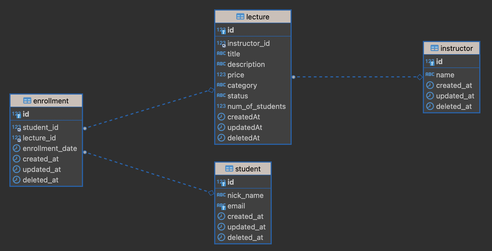

# lms-ts-node

## 1. Outline

### 1.1. Introduction

아래의 조건을 만족하는 강의 시스템 API를 구현해주세요.
모든 테이블/프로젝트 구조는 본인이 아는 선에서 가장 좋은 형태로 만들어 주세요.
URL을 비롯해서 테이블명, 클래스명, 파일명, function명 등 아래 서술된 내용을 제외한 모든 내용들은 할 수 있는 가장 좋은 컨벤션을 따라 진행합니다.
직접 서비스 한다는 생각으로 최대한 협업하기 좋고, 견고하고, 구조화되고, 확장에 열려 있는 구조로 프로젝트를 만들어주세요.

### 1.2. Directories

```
📦src
┣ 📂common
┃ ┣ 📂error
┃ ┃ ┣ 📂http-error// HTTP 응답 에러 클래스
┃ ┣ 📂pagination // 페이징 관련 클래스
┃ ┗ 📂util // 유틸 클래스
┣ 📂lecture // 강의 애그리거트
┃ ┣ 📂application // 애플리케이션 계층
┃ ┃ ┣ 📂adapter // 외부 API 인터페이스
┃ ┣ 📂domain // 도메인 계층
┃ ┃ ┣ 📂repository // 레포지토리 인터페이스
┃ ┃ ┃ ┣ 📂dto // 검색 및 응답 dto
┃ ┣ 📂infra // 인프라 계층
┃ ┃ ┣ 📂adapter // 외부 API 구현체
┃ ┃ ┗ 📂repository // 레포지토리 구현체
┃ ┣ 📂interface // 인터페이스 계층
┃ ┣ 📂routes // 라우터
┣ 📂student // 학생 애그리거트
┣ 📂instructor // 강사 애그리거트
┣ 📂middleware // 미들웨어
┣ 📜app.config.ts // 앱 의존성 주입
┣ 📜app.ts
┣ 📜db.ts
┗ 📜server.ts
```

## 2. Installation

### 2.1. NodeJS

```
SKIP
```

### 2.2. MySQL

```
# PULL DOCKER MySQL IMAGE
docker pull mysql

# RUN DOCKER MySQL
docker run --name mysql-lms -e MYSQL_ROOT_PASSWORD=1234 -d -p 3306:3306 mysql:latest
```

### 2.3. Repository

```
# CLONE REPOSITORY
git clone ${REPOSITORY}
cd lms-ts-node

# INSTALL DEPENDENCIES
npm install

# START DEVELOPMENT
npm run dev
```

### 2.4. Data

```
# Seed initial data
npm run setup

# Run test code
npm run test
```

## 3. Development

### 3.1. ERD


